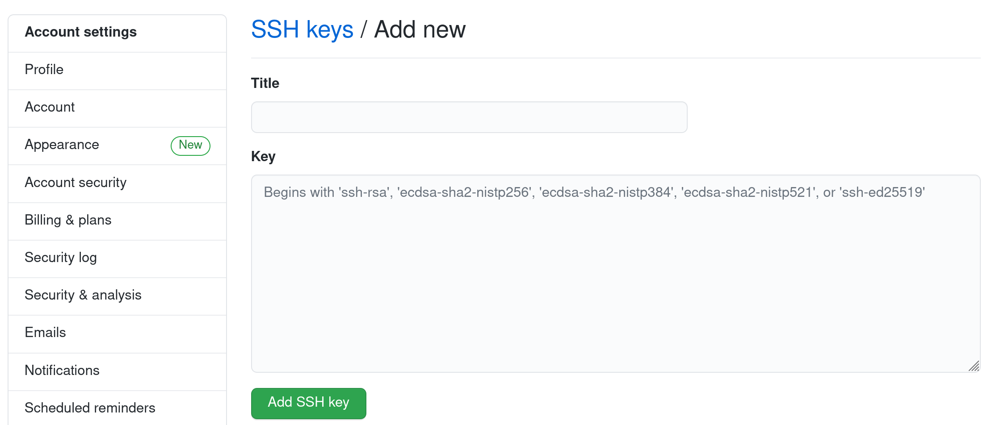

# Git mit SSH-Keys verwenden

## Neuen Key erzeugen

```bash
ssh-keygen -t ed25519 -C "your_email@example.com" -f ~/github-key
```

## Key für GitHub verwenden

In den SSH-Settings folgendes Eintragen

```bash
Host github.com
  IdentityFile ~/github-key
  IdentitiesOnly yes
  Port 22
```

## Public Key in GitHub eintragen

`cat github-key.pub`und das ganze dann in Github als SSH-Key eintragen.

Das ganze geht mit dem Programm xclip auch gut.

    cat github-key.pub | xclip -i -sel clip
    
 und dann auf folgender Seite den Key hinzufügen.
 
https://github.com/settings/keys

